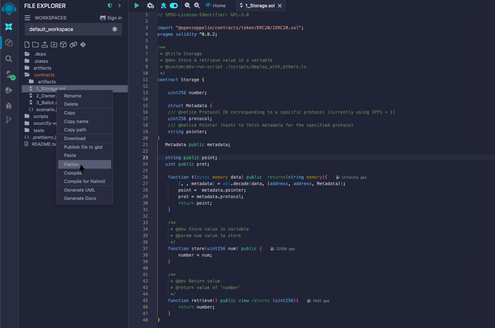
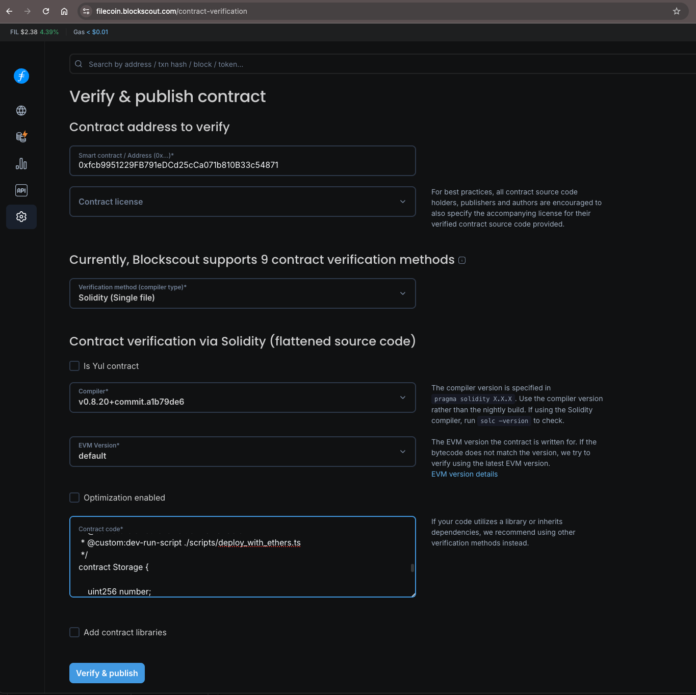
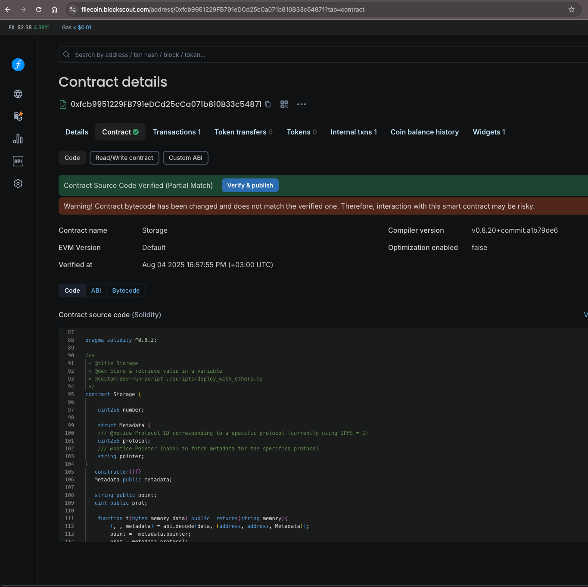

## Verification tutorial with Blockscout

The following guide walks you through the process of contract verification using the [Blockscout](https://filecoin.blockscout.com/) explorer.

### Prerequisites

- A smart contract (`.sol` file)
- [Remix](https://remix.ethereum.org/)

### Procedure

1. Open Remix:



2. In the **File Explorer** sidebar tab, under **contracts**, right click on the contract you want to verify.
3. From the menu, select **Flatten** to flatten the `<contract-name>.sol` file and ensure that all components and tasks are included.

   A new contract with the name `<contract-name>_flattened.sol` is generated below your original contract.

4. Ensure that the license and Solidity version in the flattened contract is the same as in your original contract.
5. Click **Save**.
6. Right click on `<contract-name>_flattened.sol`.
7. In the menu, click **Download** to save the file.
8. Note the following information, as you will need it later:
   - The address of your deployed contract
   - The contract license type (if any)
   - The Solidity compiler version
   - Optimization details (if any)
9. Navigate to [Blockscout](https://filecoin.blockscout.com/contract-verification).
10. In the form, enter the information noted previously for the deployed contract you would like to verify:
    - The address
    - The license type(optional)
    - Select verification method `Solidity (Single file)` and then:
      - Fill the compiler version
      - Paste the source code of the `<contract-name>_flattened.sol` contract
      - Fill or disable the `Optimization enabled` checkbox



11. Click **Verify & Publish**.

```
Success! Your contract is now verified. Blockscout will redirect you to your verfied contract dashboard!
```



[Was this page helpful?](https://airtable.com/apppq4inOe4gmSSlk/pagoZHC2i1iqgphgl/form?prefill_Page+URL=https://docs.filecoin.io/smart-contracts/developing-contracts/verify-a-contract)
